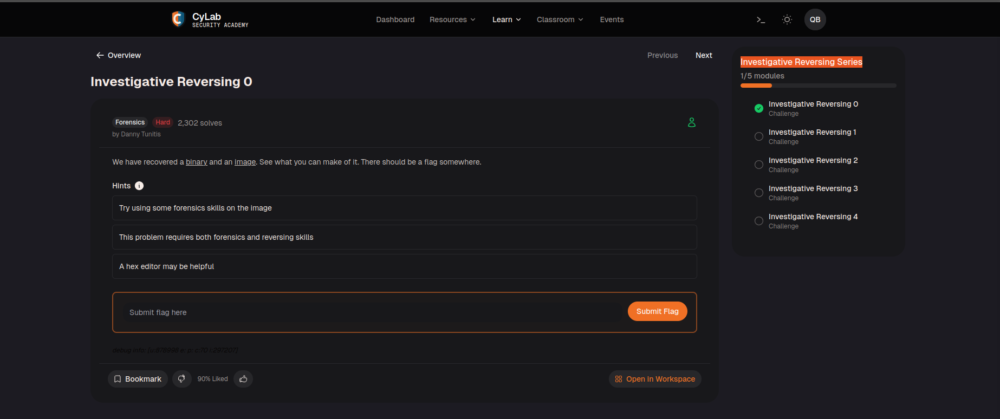
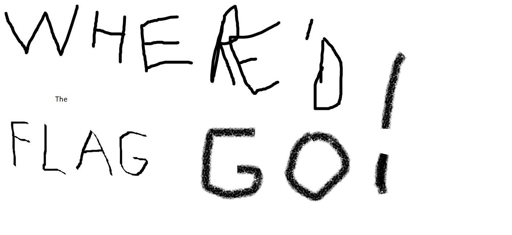
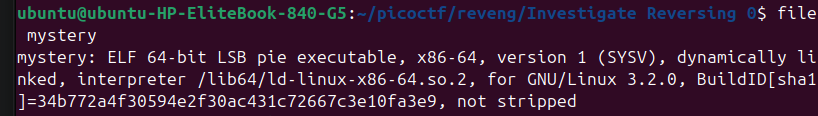
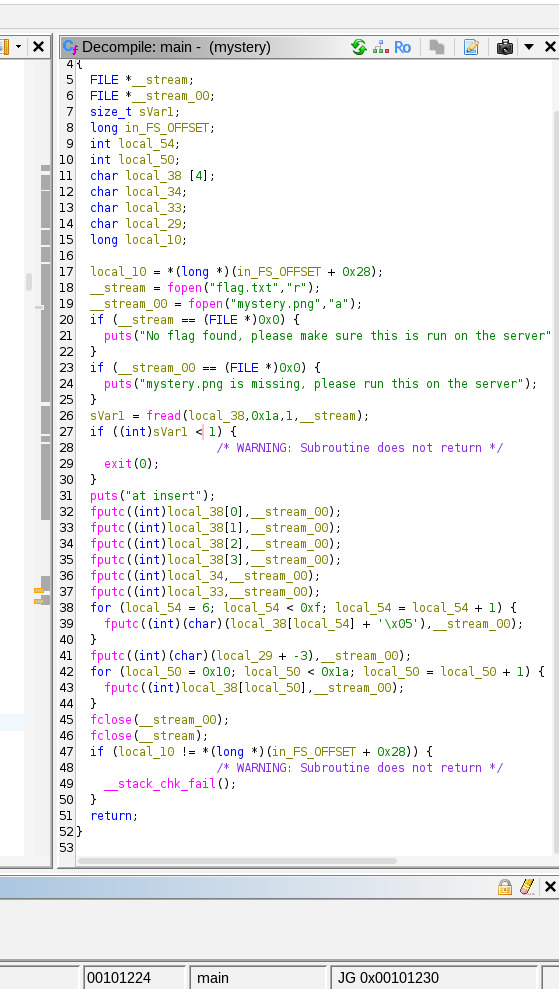
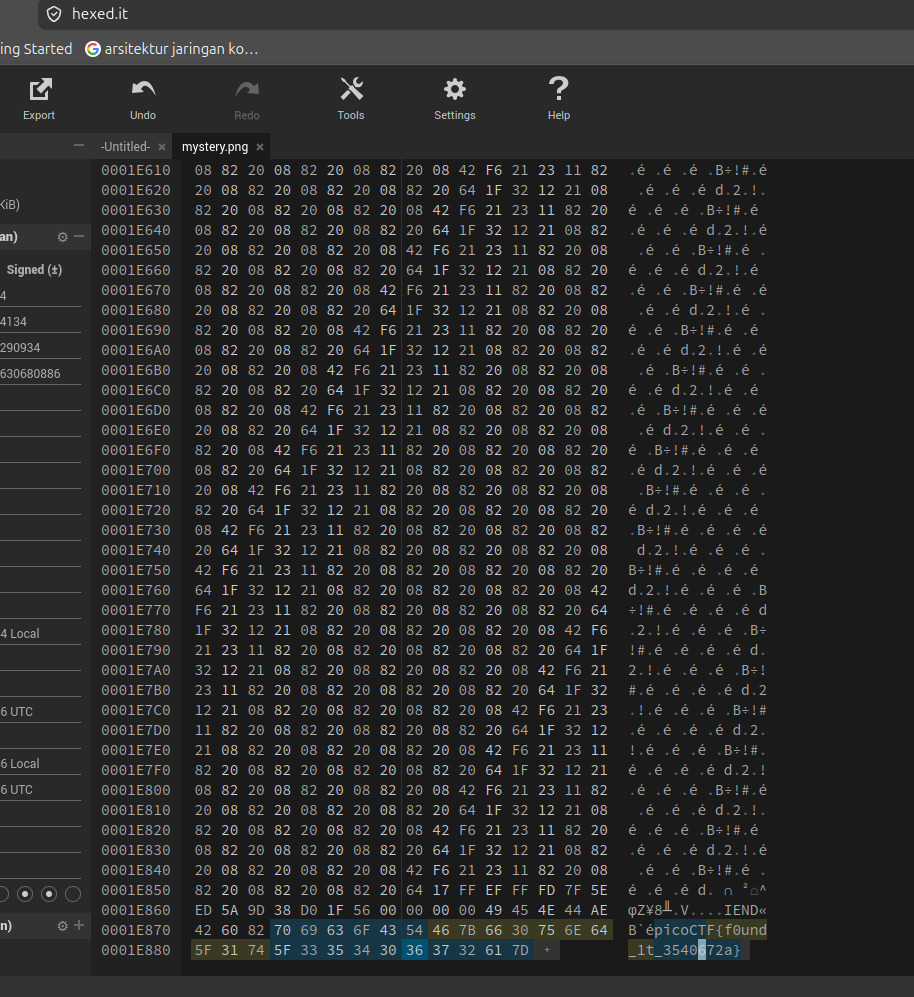

# Investigate Reversing 0

Pada Challenge ini, kita diberikasn 2 buah file yaitu ELF mystery dan juga mystery.png. 

mystery.png:

Jika diliat, file mystery merupakan file ELF 64 bit

Lalu, kita coba analisis fungsi main dengan ghidra dan hasil compilenya seperti berikut.

Nah, di sini aku menggunakan LLM untuk menjelaskan program tersebut dan hasilnya adalah sebagai berikut:
Secara garis besar, program ini berfungsi untuk membaca flag.txt dari file teks, melakukan sedikit modifikasi (enkripsi sederhana) pada beberapa karakternya, lalu menyisipkan flag tersebut ke bagian paling akhir dari mystery.png.

Program memulai operasinya dengan membuka dua buah file:
1. flag.txt dibuka dalam mode Read ("r") untuk dibaca isinya.
2. mystery.png dibuka dalam mode Append ("a") yang berarti program tidak akan merusak gambar aslinya, melainkan hanya akan menempelkan data baru di bagian paling bawah file tersebut (setelah penanda akhir gambar/IEND).

Menggunakan fungsi fread, program membaca tepat 26 byte dari flag.txt dan menyimpannya ke dalam memori komputer (dimulai dari variabel local_38). Jika panjang flag kurang dari 1 byte (kosong), program akan otomatis berhenti.

Alih-alih memasukkan 26 karakter tersebut secara utuh, program membaginya ke dalam 4 fase modifikasi sebelum menempelkannya ke mystery.png:

    Fase 1: Karakter 0 - 5
    Enam karakter pertama (indeks 0 sampai 5) ditulis ke dalam gambar secara utuh tanpa perubahan apa pun.

    Fase 2: Karakter 6 - 14 (Enkripsi +5)
    Melalui perulangan pertama, 9 karakter selanjutnya akan ditambah nilai ASCII-nya sebanyak 5 (+ '\x05').

    Fase 3: Karakter 15 (Enkripsi -3)
    Khusus untuk karakter di indeks ke-15, nilainya akan dikurangi 3 (+ -3) sebelum ditulis ke dalam gambar.

    Fase 4: Karakter 16 - 25
    Melalui perulangan kedua, sisa 10 karakter terakhir akan dimasukkan secara utuh tanpa modifikasi apa pun hingga flag selesai ditulis.

Nah, setelah mengetahui ini, kita tinggal mencari 26 bytes setelah bytes akhir dari mystery.png (png biasanya diakhiri dengan IEND). Setelah itu, kita bisa menggunakan hexeditor untuk mengembalikkan bytesnya semula. Misalnya, karakter 6 - 14 tinggal kurangi -5 dari kode hexnya, dan karakter 15 tambah +3 dari kode hexnya, sehingga hasil akhirnya adalah seperti ini:

Flag: picoCTF{f0und_1t_3540672a}