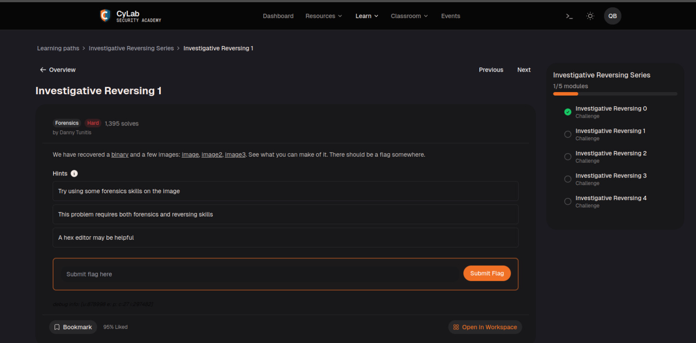
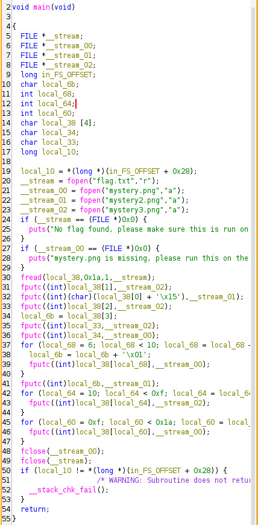
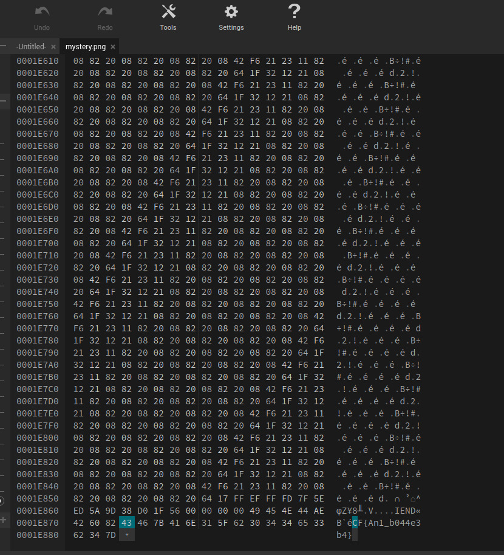
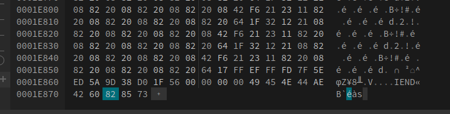
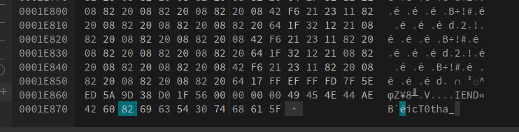

# Investigate Reversing 1

Pada Challenge ini, kita diberikan sebuah buah file yaitu ELF mystery dan 3 file png. 



Lalu, kita coba analisis fungsi main dengan ghidra dan hasil compilenya seperti berikut.



Nah, di sini aku menggunakan LLM untuk menjelaskan program tersebut dan hasilnya adalah sebagai berikut: Secara garis besar, program ini membaca flag.txt, mencincang flag tersebut, melakukan modifikasi (enkripsi) pada beberapa karakternya, lalu menyebarkan potongan-potongan flag tersebut ke bagian paling akhir dari tiga file gambar yang berbeda: mystery.png, mystery2.png, dan mystery3.png.

Program memulai operasinya dengan membuka empat buah file:

    flag.txt dibuka dalam mode Read ("r") untuk dibaca isinya.

    mystery.png, mystery2.png, dan mystery3.png dibuka dalam mode Append ("a") yang berarti program tidak akan merusak gambar aslinya, melainkan hanya menempelkan data baru di bagian paling bawah masing-masing file tersebut (setelah penanda akhir gambar/IEND).

Program membaca tepat 26 byte dari flag.txt dan menyimpannya ke dalam memori komputer (dimulai dari variabel local_38 dan meluber ke memori di sebelahnya). Jika panjang flag kurang dari 1 byte, program akan otomatis berhenti.

Karena di var tadi cuma didefinisikan var local_38[4] (bytes 1-4 dari flag), local_34 (bytes 5 dari flag), local_33 (bytes 6 dari flag), lalu tidak ada var lain yang menampung bytes sisa (20 sisa bytes), maka ghidra memberi local_38[6] hingga local_38[25] untuk menampung bytes 7 - 26.

`fputc((int)local_38[1],__stream_02);` bytes ke 2 flag dimasukkan ke dalam mystery3.png.

`fputc((int)(char)(local_38[0] + '\x15'),__stream_01);` bytes pertama dimasukkan ke dalam mystery2.png dan ditambah desimal 21.

`fputc((int)local_38[2],__stream_02);` bytes ke 3 flag dimasukkan ke dalam mystery3.png.

`local_6b = local_38[3];` bytes ke 4 flag ditampung di var local_6b.

`fputc((int)local_33,__stream_02);` bytes ke 6 flag dimasukkan ke dalam mystery3.png.

`fputc((int)local_34,__stream_00);` bytes ke 5 flag dimasukkan ke dalam mystery.png.

```c
for (local_68 = 6; local_68 < 10; local_68 = local_68 + 1) {
    local_6b = local_6b + '\x01';
    fputc((int)local_38[local_68],__stream_00);
}
fputc((int)local_6b,__stream_01);
```
local_38[6] hingga local_38[9] (bytes 7 hingga 10 dari flag) dimasukkan ke dalam mystery.png, dan local_6b tadi diloop 4 kali dan sekarang +4 dimasukkan ke mystery2.png.

```c
  for (local_64 = 10; local_64 < 0xf; local_64 = local_64 + 1) {
    fputc((int)local_38[local_64],__stream_02);
  }
  for (local_60 = 0xf; local_60 < 0x1a; local_60 = local_60 + 1) {
    fputc((int)local_38[local_60],__stream_00);
  }
```
local_38[10] hingga local_38[15] (bytes 11 hingga 16 dari flag) dimasukkan ke dalam mystery3.png. local_38[16] hingga local_38[26] (bytes 17 hingga 26 dari flag) dimasukkan ke dalam mytery.png.

<br>

Untuk urutan pengelompokkan tujuan bytesnya sebagai berikut:
1. mystery.png (Total: 16 Bytes)

File ini menampung bagian terbesar dari flag secara utuh (tanpa modifikasi).

    Byte ke-5 (dari local_34)

    Byte ke-7 sampai 10 (dari loop local_38[6] hingga local_38[9])

    Byte ke-16 sampai 26 (dari loop local_38[15] hingga local_38[25])

2. mystery2.png (Total: 2 Bytes)

File ini khusus menampung byte yang sudah dimodifikasi.

    Byte ke-1 (dari local_38[0], nilainya ditambah 21 (\x15))

    Byte ke-4 (dari local_6b atau local_38[3], nilainya ditambah 4 karena perulangan)

3. mystery3.png (Total: 8 Bytes)

File ini menampung sisa byte asli yang posisinya diloncat-loncat.

    Byte ke-2 (dari local_38[1])

    Byte ke-3 (dari local_38[2])

    Byte ke-6 (dari local_33)

    Byte ke-11 sampai 15 (dari loop local_38[10] hingga local_38[14])

<br>
Dengan hex editor, bisa lihat bytes hex dari tiap imagenya.

mystery.png:



mystery.png ini menambung 16 bytes tambahan yang dimulai dari hex 43 hingga akhir ( 43 46 7B 41 6E 31 5F 62 30 34 34 65 33 62 34 7D ), dengan urutannya sebagai berikut:
    Byte 5 => 43 (C)

    Byte 7 => 46 (F)

    Byte 8 => 7B ({)

    Byte 9 => 41 (A)

    Byte 10 => 6E (n)

    Byte 16 => 31 (1)

    Byte 17 => 5F (_)

    Byte 18 => 62 (b)

    Byte 19 => 30 (0)

    Byte 20 => 34 (4)

    Byte 21 => 34 (4)

    Byte 22 => 65 (e)

    Byte 23 => 33 (3)

    Byte 24 => 62 (b)

    Byte 25 => 34 (4)

    Byte 26 => 7D (})

<br>

mystery2.png:



mystery2.png ini menampung 2 bytes tambahan yang dimulai dari hex 85 hingga akhir (85 73). Karena data di file ini telah dimodifikasi (ditambah nilainya) oleh program, kita harus membalikkan logikanya dengan mengurangkan nilai tersebut ke bentuk aslinya. Urutannya sebagai berikut:

Byte 1 => 85 
    Byte 1 ditambah desimal 21 (`\x15`). 

    Dekripsi: 85 hex (133 desimal) - 21 = 112 desimal (70 hex). 

    Bytes asli: 70 (p)

Byte 4 => 73 
    Byte 4 terkena jebakan loop dan ditambah desimal 4 (`\x04`).

    Dekripsi: 73 hex (115 desimal) - 4 = 111 desimal (6F hex).

    Bytes asli: 6F (o)

<br>

mystery3.png:




mystery3.png ini menampung 8 bytes tambahan yang dimulai dari hex 69 hingga akhir ( 69 63 54 30 74 68 61 5F ), tepat setelah penanda IEND dan 4 byte CRC (AE 42 60 82). Karena tidak ada modifikasi nilai, kita bisa langsung memetakannya ke indeks flag. Urutannya sebagai berikut:

    Byte 2 => 69 (i)

    Byte 3 => 63 (c)

    Byte 6 => 54 (T)

    Byte 11 => 30 (0)

    Byte 12 => 74 (t)

    Byte 13 => 68 (h)

    Byte 14 => 61 (a)

    Byte 15 => 5F (_)

<br>

Sekarang kita cuma perlu menyusun ke dalam urutan bytes yang benar, sehingga flag yang didapat adalah:
picoCTF{An0tha_1_b044e3b4}