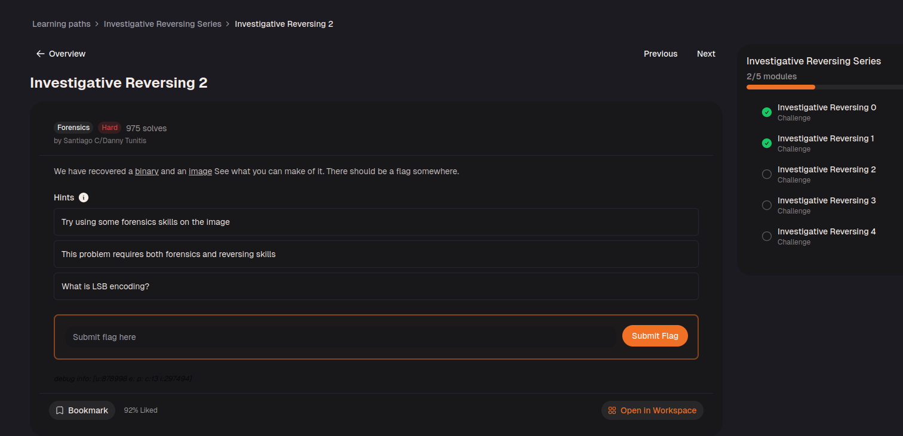
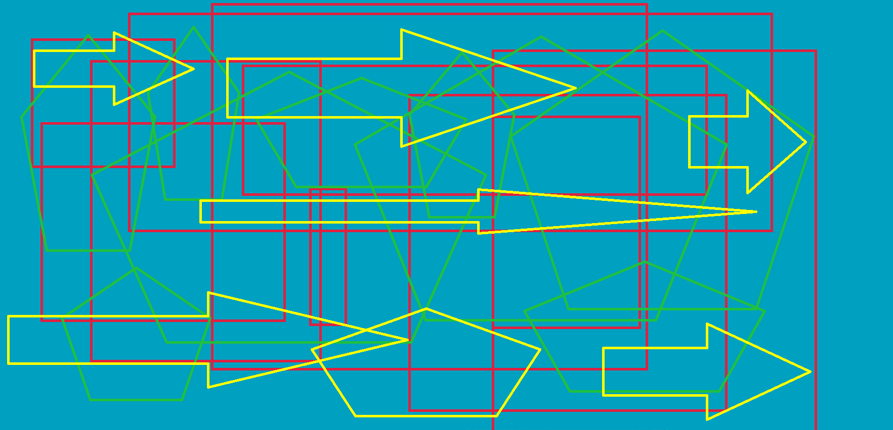

# Investigate Reversing 2

Pada challenge ini, kita diberikan sebuah file binary dan juga sebuah image.



`encoded.bmp`:



Di sini aku menganalisis fungsi main di ghidra dan setelah rename beberapa variabelnya hasilnya adalah sebagai berikut:

```c
undefined8 main(void)

{
  size_t sVar1;
  long in_FS_OFFSET;
  char local_7e;
  char local_7d;
  int local_7c;
  int i;
  int j;
  int k;
  undefined4 local_6c;
  int counter;
  int local_64;
  FILE *flag;
  FILE *original;
  FILE *encoded;
  char local_48 [56];
  long local_10;
  
  local_10 = *(long *)(in_FS_OFFSET + 40);
  local_6c = 0;
  flag = fopen("flag.txt","r");
  original = fopen("original.bmp","r");
  encoded = fopen("encoded.bmp","a");
  if (flag == (FILE *)0x0) {
    puts("No flag found, please make sure this is run on the server");
  }
  if (original == (FILE *)0x0) {
    puts("original.bmp is missing, please run this on the server");
  }
  sVar1 = fread(&local_7e,1,1,original);
  local_7c = (int)sVar1;
  counter = 2000;
  for (i = 0; i < counter; i = i + 1) {
    fputc((int)local_7e,encoded);
    sVar1 = fread(&local_7e,1,1,original);
    local_7c = (int)sVar1;
  }
  sVar1 = fread(local_48,50,1,flag);
  local_64 = (int)sVar1;
  if (local_64 < 1) {
    puts("flag is not 50 chars");
                    /* WARNING: Subroutine does not return */
    exit(0);
  }
  for (j = 0; j < 50; j = j + 1) {
    for (k = 0; k < 8; k = k + 1) {
      local_7d = codedChar(k,(int)(char)(local_48[j] + -5),(int)local_7e);
      fputc((int)local_7d,encoded);
      fread(&local_7e,1,1,original);
    }
  }
  while (local_7c == 1) {
    fputc((int)local_7e,encoded);
    sVar1 = fread(&local_7e,1,1,original);
    local_7c = (int)sVar1;
  }
  fclose(encoded);
  fclose(original);
  fclose(flag);
  if (local_10 == *(long *)(in_FS_OFFSET + 0x28)) {
    return 0;
  }
                    /* WARNING: Subroutine does not return */
  __stack_chk_fail();
}
```

Di sini, aku bertanya ke LLM tentang mekanisme program ini. Secara garis besar, program ini membaca isi dari flag.txt, lalu menyembunyikan teks tersebut ke dalam sebuah gambar bernama original.bmp menggunakan teknik steganografi Least Significant Bit (LSB). Untuk mempersulit ekstraksi, program juga melakukan modifikasi (enkripsi sederhana) pada setiap karakter flag sebelum disisipkan. Hasil akhirnya disimpan menjadi gambar baru bernama encoded.bmp.

Program memulai operasinya dengan membuka tiga buah file:

    flag.txt dibuka dalam mode Read ("r") untuk dibaca isi teks rahasianya.

    original.bmp dibuka dalam mode Read ("r") untuk dijadikan gambar carrier (pembawa pesan).

    encoded.bmp dibuka dalam mode Append ("a") yang berarti program akan membuat gambar baru dan menuliskan datanya ke file ini sedikit demi sedikit.

```c
counter = 2000;
for (i = 0; i < counter; i = i + 1) {
  fputc((int)local_7e,encoded);
  sVar1 = fread(&local_7e,1,1,original);
  local_7c = (int)sVar1;
}
```

Program membaca 2000 byte pertama dari original.bmp lalu menyalinnya mentah-mentah langsung ke encoded.bmp tanpa modifikasi apa pun.

`sVar1 = fread(local_48,50,1,flag);` Program membaca tepat 50 byte (50 karakter) dari flag.txt dan menyimpannya ke dalam variabel array memori bernama local_48.

```c
for (j = 0; j < 50; j = j + 1) {
  for (k = 0; k < 8; k = k + 1) {
    local_7d = codedChar(k,(int)(char)(local_48[j] + -5),(int)local_7e);
    fputc((int)local_7d,encoded);
    fread(&local_7e,1,1,original);
  }
}
```

for (j = 0; j < 50...) Loop ini mengeksekusi 50 karakter flag satu per satu. for (k = 0; k < 8...): Karena 1 karakter terdiri dari 8 bit, program memecah 1 karakter menjadi 8 bagian untuk disisipkan ke dalam 8 byte piksel gambar secara terpisah. local_48[j] + -5: Sebelum disisipkan, nilai ASCII dari setiap karakter flag dikurangi 5. codedChar(...): Bit yang sudah dimodifikasi tersebut kemudian dimasukkan ke dalam 1 byte warna gambar (local_7e), lalu byte yang sudah disusupi pesan (local_7d) ditulis ke encoded.bmp.

```c
while (local_7c == 1) {
  fputc((int)local_7e,encoded);
  sVar1 = fread(&local_7e,1,1,original);
  local_7c = (int)sVar1;
}
```

Program menyalin seluruh sisa byte piksel dari original.bmp ke encoded.bmp hingga file benar-benar habis (EOF), lalu menutup semua file yang terbuka.

Di sini, tinggal buat program python yang membaca bytes dimulai dari bytes 2000 hingga 2400 (karena ada 400 bytes yang termodifikasi) dan mengambil bits paling kanan dari tiap byte dan menyusun 8 bits yang didapat dari 8 bytes menjadi ASCII dan ditambah +5.

```py
def extract_flag():
    with open('./encoded.bmp','rb') as f:
        f.seek(2000)
        hidden_bytes = f.read(400)

    flag=""

    for i in range(0, 400, 8):
        chunk = hidden_bytes[i:i+8]

        binary_str=""
        for byte in chunk:
            lsb = byte & 1
            binary_str = str(lsb) + binary_str

        char_dec = int(binary_str, 2)
        original_char_dec = char_dec + 5
        flag += chr(original_char_dec)

    print("Flag:", flag)

if __name__ == "__main__":
    extract_flag()
```

Di sini, `binary_str = str(lsb) + binary_str` akan menyusun bits dari kanan ke kiri, sehingga hasil ASCII nya akan benar.

Setelah dijalankan, didapatkan flag berikut:
picoCTF{n3xt_0n3000000000000000000000000047677c34}